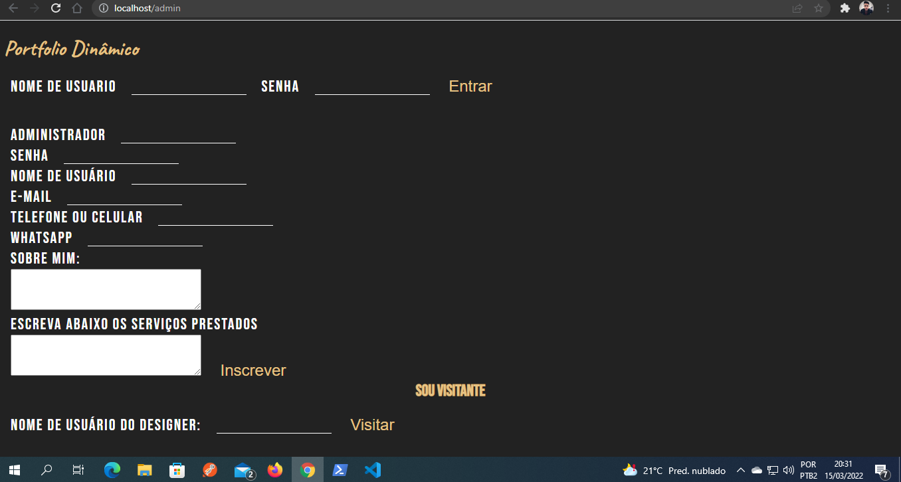

# Portfolio example learning
Neste projeto, viso transformar um portfolio estático em um dinâmico. No caso será um portfolio de um designer gráfico.
https://github.com/igoryan260/portfolio_example_learning/blob/main/LICENSE

## Sobre o Projeto
 Portfolio Exemplo Teste - é um projeto tanto para aprendizado das tecnologias que serão utilizadas quanto para aperfeiçoar o desenvolvimento profissional. Desde os métodos de desenvolvimento até o projeto final totalmente funcional.

O dono do portfolio poderá:
 - enviar seus projetos &#40; no caso suas artes &#41;;
 - terá acesso na página principal as suas últimas artes;
 - suas formas de entrar em contato;
 - formas de pagamento;
 - e outras informações pessoais;

 Projeto em desenvolvimento...

 ## Layout

Layouts disponíveis neste link:

<<<<<<< HEAD
<a>https://drive.google.com/drive/folders/1etaWLMRTP3kW4XHZERfB-unQxt7FWbxj?usp=sharing</a>
=======
>>>>>>> 6b069956ed3b58008ea2267b47835940eaab14c6

 ### Cores

- Cores utilizadas: 
   Preto: #222222
   Preto: #1c1c1c
   Bege:  #e7c282

 ### fontes

 Caveat &#40; Regular &#41;
 Bebas Neue &#40; Regular &#41;

## Tecnologias

As tecnologias utilizadas no projeto

- [HTML5][html5]
- [node.js][node.js]
- [css3][css3]
- [mongodb][mongodb]

### Features

- [x] Cadastro de usuário &#41; Designer &#41;
- [x] Uploads de projetos
- [x] Exclusão de projetos
- [ ] Mudança de temas &#40; Entre claro e escuro &#41;

## Demonstração da aplicação

### Página inicial do portfolio

  - Fazer login
  - Cadastrar novo designer
  - Visitar um portfolio

<h1 align="center">
  
</h1>

### Página do administrador 

<h1 align="center">
  
</h1>

### Excluir um projeto

<h1 align="center">
  
</h1>

### Visitante

<h1 align="center">
  
</h1>

### Visitante para expadir um projeto

<h1 align="center">
  
</h1>

### Visitante para ver contatos

<h1 align="center">
  
</h1>

### Visitante para ver serviços

<h1 align="center">
  
</h1>

### Visitante para ver sobre mim

<h1 align="center">
  
</h1>

## Requisitos para rodar esta aplicação

 - Ter o NODE.js instalado na máquina
 - Instalar as seguintes dependências :
  nodemon; consign; mongodb; express; body-parser; express; express-session; md5; multer; session; ejs; 

## Autor

 - Igor &#40; Como desenvolvedor backend &#41;
 - Othon &#40; Como desenvolvedor frontend e testes &#41;
